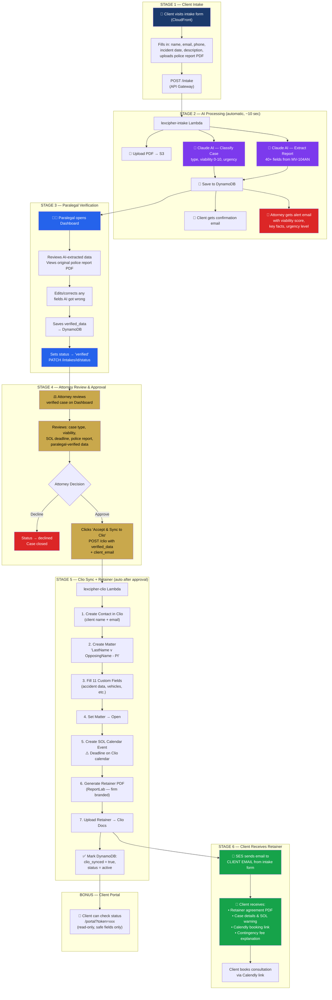

<p align="center">
  
  
  
  
  
</p>

# ⚖️ LexCipher — Intelligent Legal Intake Automation

> AI-powered police report extraction, case classification, and end-to-end case management automation for personal injury law firms.

LexCipher transforms a process that takes **hours of manual paralegal work** into a **2-minute automated pipeline** — from client inquiry to Clio matter creation, SOL tracking, and retainer delivery.

---

## 🎯 What It Does

A client fills out a web form and uploads a police report. From that moment, LexCipher:

1. **Classifies the case** using Claude AI (type, viability 0–10, urgency, SOL risk)
2. **Extracts 40+ fields** from the NY MV-104AN police report using Claude AI
3. **Alerts the attorney** with a viability summary via email
4. **Lets the paralegal verify** AI-extracted data on a dashboard
5. **Syncs everything to Clio** after attorney approval (contact, matter, 11 custom fields, calendar event)
6. **Generates a retainer agreement PDF** with all case data pre-filled
7. **Emails the client** the retainer + Calendly booking link

All serverless. All automated. Zero manual data entry.

---

## 🏗️ Architecture Diagram


---

## 🔄 Automation Pipeline


---

## 📁 Project Structure

```
├── intake-form/
│   └── index.html                  # Client-facing intake form
│
├── lexcipher-intake/                # Lambda: intake processing + AI
│   ├── handler.py                  # Entry point — validates, orchestrates
│   ├── ai_classifier.py           # Claude AI calls (classify + extract)
│   ├── prompt.py                  # Detailed AI prompts for NY MV-104AN form
│   ├── db.py                      # DynamoDB operations
│   ├── emailer.py                 # SES: client confirmation + attorney alert
│   └── requirements.txt
│
├── lexcipher-clio/                  # Lambda: Clio sync + retainer
│   ├── handler.py                  # Clio API, PDF generation, retainer email
│   ├── extractor.py               # Backup AI extraction from S3
│   └── requirements.txt
│
├── dashboard/                       # Lambda: dashboard API + frontend
│   ├── handler.py                  # CRUD for intakes, portal, PDF presign
│   └── index.html                  # Paralegal/attorney dashboard
│
├── portal/
│   └── index.html                  # Client status portal (read-only)
│
├── template.yaml                   # AWS SAM — all infrastructure as code
├── clio_setup.py                   # One-time Clio custom field setup
├── clio_add_fields.py              # Helper for adding Clio fields
└── .github/workflows/
    └── deploy.yml                  # CI/CD: push to main → auto deploy
```

---

## 🤖 How Claude AI Is Used

LexCipher makes **two AI calls** per intake, both using `claude-haiku-4-5`:

### Call 1 — Case Classification

| | |
|---|---|
| **Input** | Client's name, description, incident date |
| **Output** | `case_type`, `viability_score` (0–10), `urgency`, `sol_flag`, `key_facts`, `recommended_action` |
| **Prompt** | `lexcipher-intake/prompt.py` → `CLASSIFICATION_SYSTEM_PROMPT` |

### Call 2 — Police Report Extraction

| | |
|---|---|
| **Input** | Police report PDF (base64) |
| **Output** | 40+ structured fields (dates, names, vehicles, plates, injuries, fault, narrative, SOL) |
| **Prompt** | `lexcipher-intake/prompt.py` → `EXTRACTION_SYSTEM_PROMPT` |
| **Supported Form** | New York MV-104AN Police Accident Report |

The AI handles vehicle-vs-vehicle, vehicle-vs-bicycle, and vehicle-vs-pedestrian cases automatically by detecting which checkbox is marked on the police report header.

---

## ⚙️ AWS Resources (created by `template.yaml`)

| Resource | Service | Purpose |
|----------|---------|---------|
| `lexcipher-intake-prod` | Lambda | Intake processing + AI extraction |
| `lexcipher-clio-prod` | Lambda | Clio sync + retainer generation |
| `lexcipher-dashboard-prod` | Lambda | Dashboard API + client portal |
| `lexcipher-api-prod` | API Gateway | REST API with CORS |
| `lexcipher-intakes` | DynamoDB | Case data storage |
| `lexcipher-police-reports-*` | S3 | Police report PDFs (AES256, 7yr retention) |
| `lexcipher-frontend-*` | S3 | Static frontend hosting |
| CloudFront Distribution | CloudFront | HTTPS frontend delivery |
| `/lexcipher/anthropic/api_key` | SSM | Claude AI API key (encrypted) |
| `/lexcipher/clio/access_token` | SSM | Clio OAuth2 token (encrypted) |
| `lexcipher-deps` | Lambda Layer | Shared Python dependencies |

---

## 🔌 External Integrations

### Anthropic Claude AI
- **Model:** `claude-haiku-4-5`
- **Auth:** API key stored in AWS SSM Parameter Store
- **Used for:** Case classification + police report data extraction

### Clio Manage (API v4)
- **Base URL:** `https://app.clio.com/api/v4`
- **Auth:** OAuth2 Bearer token stored in AWS SSM
- **Resources:** Contacts, Matters, Custom Fields, Calendar Entries, Documents
- **Custom Fields:** 11 fields mapped (Accident Date, Location, Vehicles, Plates, Police Report #, SOL Date, etc.)

### Calendly
- **Purpose:** Client consultation booking
- **Summer/Spring (Mar–Aug):** In-office link
- **Winter/Autumn (Sep–Feb):** Virtual link

### Amazon SES
- **Sender:** `ch.pradhan606@gmail.com`
- **Emails sent:** Client confirmation, attorney alert, retainer delivery with PDF attachment
- **Requirement:** SES production access needed to send to any recipient

---

## 🚀 Deployment

### Prerequisites

- AWS account with IAM credentials
- GitHub repository with Actions enabled
- Anthropic API key ([console.anthropic.com](https://console.anthropic.com))
- Clio API access token ([app.clio.com/settings/developer_apps](https://app.clio.com/settings/developer_apps))
- SES verified sender email (and production access for unrestricted sending)

### GitHub Secrets Required

| Secret | Description |
|--------|-------------|
| `AWS_ACCESS_KEY_ID` | IAM access key |
| `AWS_SECRET_ACCESS_KEY` | IAM secret key |
| `AWS_ACCOUNT_ID` | AWS account number |
| `ANTHROPIC_API_KEY` | Claude AI API key |
| `CLIO_ACCESS_TOKEN` | Clio OAuth2 access token |

### Deploy

Push to `main` and GitHub Actions handles everything:

```bash
git add .
git commit -m "deploy"
git push origin main
```

The CI/CD pipeline will:
1. Build Lambda layer with dependencies
2. Package and deploy all Lambdas via SAM
3. Inject API URL into frontend files
4. Upload frontend to S3
5. Invalidate CloudFront cache

### Manual Deploy (SAM CLI)

```bash
# Install dependencies for Lambda layer
mkdir -p layer/python
pip install anthropic==0.40.0 boto3==1.35.0 requests==2.31.0 \
    python-dateutil==2.9.0 reportlab==4.1.0 -t layer/python

# Build and deploy
sam build --use-container
sam deploy \
  --stack-name lexcipher \
  --capabilities CAPABILITY_IAM \
  --parameter-overrides \
    Stage=prod \
    AnthropicApiKey=YOUR_KEY \
    ClioAccessToken=YOUR_TOKEN \
    SesFromEmail=your@email.com \
    AttorneyEmail=attorney@email.com
```

---

## 🔗 API Endpoints

| Method | Path | Lambda | Description |
|--------|------|--------|-------------|
| `POST` | `/intake` | Intake | Submit new client inquiry |
| `POST` | `/clio` | Clio | Sync approved case to Clio |
| `GET` | `/intakes` | Dashboard | List all intakes |
| `GET` | `/intakes/{id}` | Dashboard | Get single intake details |
| `PATCH` | `/intakes/{id}/status` | Dashboard | Update status + save verified data |
| `GET` | `/intakes/{id}/pdf` | Dashboard | Get presigned S3 URL for police report |
| `DELETE` | `/intakes/{id}` | Dashboard | Delete single intake |
| `DELETE` | `/intakes/reset` | Dashboard | Clear all intakes |
| `GET` | `/portal?token=xxx` | Dashboard | Client portal (read-only) |

---

## 📊 Clio Custom Fields

11 custom fields are automatically populated in the Clio matter when a case is approved, including accident date, location, vehicles, plates, opposing party, police report number, SOL date, and more.

> Run `clio_setup.py` once to create these fields in your Clio account. Field IDs are configured in `lexcipher-clio/handler.py`.

---

## 📧 Email Flow

| Trigger | Recipient | Content |
|---------|-----------|---------|
| Client submits form | Client email | Confirmation + acknowledgment |
| Client submits form | Attorney email | Alert with viability score, urgency, key facts |
| Attorney approves case | Client email | Retainer PDF + case details + Calendly booking link |

The retainer email includes firm-branded HTML with seasonal booking links (in-office for summer, virtual for winter).

---

## 🛡️ Security

- **Secrets:** All API keys stored in AWS SSM Parameter Store (encrypted)
- **PDFs:** Stored in S3 with AES-256 server-side encryption
- **Public Access:** S3 police report bucket has all public access blocked
- **Client Portal:** Read-only, limited to safe fields (no viability scores or internal notes)
- **CORS:** Configured on API Gateway for frontend access
- **PDF Retention:** 7-year lifecycle policy (legal compliance)

---

## ⚡ NY Statute of Limitations Rules

Built into the AI classification prompt:

| Case Type | SOL Period |
|-----------|-----------|
| Vehicle Accident | 8 years from incident |
| Slip and Fall | 3 years from incident |
| Medical Malpractice | 2.5 years from incident/discovery |
| Workplace Injury | 3 years (2 years workers comp) |
| Employment Law | 3 years for most claims |
| Against Government | 90 days to file notice of claim |

---

## 🛠️ Tech Stack

| Layer | Technology |
|-------|-----------|
| Frontend | HTML/CSS/JS (single-file, no framework) |
| Hosting | S3 + CloudFront (HTTPS) |
| API | API Gateway (REST) |
| Compute | AWS Lambda (Python 3.12) |
| Database | DynamoDB (PAY_PER_REQUEST) |
| File Storage | S3 (AES-256) |
| Email | Amazon SES |
| AI | Anthropic Claude Haiku 4.5 |
| Case Management | Clio Manage API v4 |
| Scheduling | Calendly |
| Secrets | AWS SSM Parameter Store |
| IaC | AWS SAM (CloudFormation) |
| CI/CD | GitHub Actions |
| PDF Generation | ReportLab 4.1.0 |
---

## ⚠️Challenges & Lessons Learned 💡
| Problem                                          | Obstacle                                                                                                                                                                                                     | Solution                                                                                                                                                  | Impact                                                                                                               |
| ------------------------------------------------ | ------------------------------------------------------------------------------------------------------------------------------------------------------------------------------------------------------------ | --------------------------------------------------------------------------------------------------------------------------------------------------------- | -------------------------------------------------------------------------------------------------------------------- |
| **Retainer email going to wrong recipient**      | `body.get("client_email", AUTOMATION_EMAIL)` only falls back when the key is missing. When the dashboard sent `client_email: null` or `""`, `.get()` returned the falsy value instead of the fallback email. | Changed logic to `body.get("client_email") or AUTOMATION_EMAIL` so Python falls back when the value is `null`, empty string, or missing.                  | Ensures the retainer email always goes to the correct client instead of the automation inbox.                        |
| **Every client's email said "Reyes v Francois"** | Matter title in the email template was **hardcoded from test data**, causing every client to see the same case name.                                                                                         | Built a dynamic `matter_title` from `client_name` and `opposing_party_name`, extracting last names and formatting as **"{ClientLast} v {OpposingLast}"**. | Emails now show the correct case name for each client, improving professionalism and avoiding confusion.             |
| **Fallback greeting used "Guillermo"**           | If `client_name` was empty, the greeting defaulted to **"Dear Guillermo"**, a leftover from testing.                                                                                                         | Replaced fallback with **"Valued Client"** when a name is missing.                                                                                        | Prevents embarrassing test artifacts and ensures neutral, professional communication.                                |
| **AWS SES sandbox blocking client emails**       | SES sandbox only allows sending to **verified email addresses**, so real client emails entered in the intake form were rejected.                                                                             | Requested **SES production access** with a detailed transactional email use case.                                                                         | Identified the root cause of blocked emails and attempted proper AWS escalation.                                     |
| **SES production access denied**                 | AWS denied production access (common for new accounts), preventing the system from emailing real clients.                                                                                                    | Replaced SES with **Gmail SMTP (`smtplib`)** in both Lambdas and stored the Gmail App Password securely in **SSM Parameter Store**.                       | Email system now works immediately without sandbox restrictions, allowing the system to communicate with real users. |
| **Confirmation emails still not working**        | Only the **Clio Lambda** was updated to Gmail SMTP; the **Intake Lambda (`emailer.py`)** was still using SES.                                                                                                | Updated `lexcipher-intake/emailer.py` to use Gmail SMTP and added SSM permissions for the Gmail app password in `template.yaml`.                          | Restored the full email pipeline — clients now receive confirmations and attorneys receive alerts.                   |


---
##  🚀 Future Roadmap 🛣️

- Replace Gmail SMTP with Amazon SES production access once approved

- Add OCR support for handwritten police reports using Amazon Textract

- Implement authentication for the dashboard (AWS Cognito / JWT)

- Add CloudWatch monitoring and alerting for Lambda failures

- Support additional police report formats beyond NY MV-104AN

- Add rate limiting and AWS WAF protection on API Gateway

- Introduce Multi-tenancy support so multiple Law Firms can use the platform with isolated data, configurations, and dashboards

---
## 👩‍💻 Author
#### Chinmayee Pradhan
#### Network Engineer | DevOps & AI Engineer
#### LinkedIn: https://www.linkedin.com/in/chinmayee-pradhan-devops/


